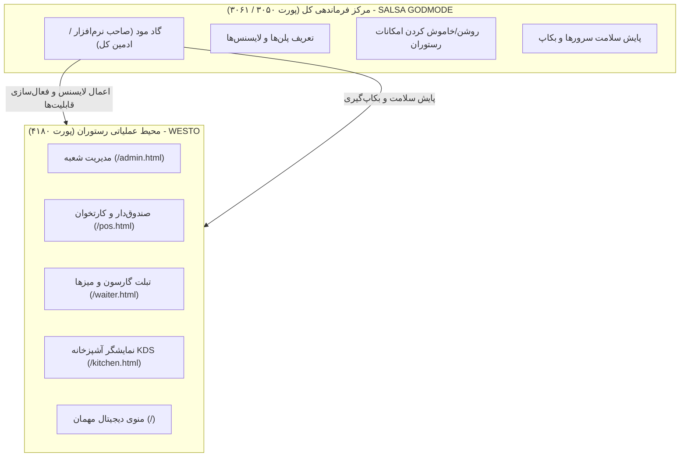

# راهنمای جامع و کاربردی مرکز کنترل گاد مود (SALSA GODMODE)
> **راهنمای گام‌به‌گام و بدون پیچیدگی فنی برای درک کامل سامانه و تسلط بر مدیریت پلتفرم**  
> **نگارش**: شهریور ۱۴۰۵ (نسخه ۲.۲ - بازطراحی‌شده برای سهولت کاربری)  
> **آدرس‌های فعال پلتفرم**:  
> • **کنترل پنل گاد مود (SALSA GODMODE)**: [http://127.0.0.1:3050](http://127.0.0.1:3050)  
> • **سامانه رستورانی و کلاینت (WESTO)**: [http://127.0.0.1:4180](http://127.0.0.1:4180)  
> • **هسته موتور پردازش و امنیت (Control Plane API)**: [http://127.0.0.1:3061](http://127.0.0.1:3061)  

---

## فهرست سرفصل‌های راهنما

1. [فصل ۱: تصویر کلان سیستم به زبان کاملاً ساده](#فصل-۱-تصویر-کلان-سیستم-به-زبان-کاملا-ساده)
2. [فصل ۲: دسته‌بندی کاربردی بخش‌های گاد مود (کجا برم؟)](#فصل-۲-دسته‌بندی-کاربردی-بخش‌های-گاد-مود-کجا-برم)
3. [فصل ۳: بررسی و کالبدشکافی تک‌تک بخش‌ها (از GM-01 تا GM-29)](#فصل-۳-بررسی-و-کالبدشکافی-تک‌تک-بخش‌ها-از-gm-01-تا-gm-29)
4. [فصل ۴: پرونده جامع هر رستوران (GM-04) و تب‌های ۱۶گانه](#فصل-۴-پرونده-جامع-هر-رستوران-gm-04-و-تب‌های-۱۶گانه)
5. [فصل ۵: دستورالعمل‌های سریع «چطور فلان کار را انجام دهم؟»](#فصل-۵-دستورالعمل‌های-سریع-چطور-فلان-کار-را-انجام-دهم)
6. [فصل ۶: کلیدهای میانبر و پالت جست‌وجوی سریع (Command Palette)](#فصل-۶-کلیدهای-میانبر-و-پالت-جست‌وجوی-سریع-command-palette)
7. [فصل ۷: واژه‌نامه اصطلاحات فنی به زبان خودمانی](#فصل-۷-واژه‌نامه-اصطلاحات-فنی-به-زبان-خودمانی)

---

## فصل ۱: تصویر کلان سیستم به زبان کاملاً ساده

اگر کنترل پنل گاد مود برای شما گیج‌کننده است، کاملاً طبیعی است! چون گاد مود **پنل معمولی رستوران نیست**، بلکه مانند **مرکز فرماندهی کل پلتفرم نرم‌افزاری** عمل می‌کند.

برای درک آسان، این تمثیل ساده را در نظر بگیرید:



### مقایسه دو بخش در یک نگاه:

| ویژگی | سامانه رستوران وستو (WESTO - پورت ۴۱۸۰) | مرکز کنترل گاد مود (SALSA - پورت ۳۰۵۰) |
| :--- | :--- | :--- |
| **نقش چیست؟** | رستوران، کافه یا فست‌فود فعال | دفتر مرکزی ارائه نرم‌افزار (SaaS Provider) |
| **چه کسانی استفاده می‌کنند؟** | مشتری، گارسون، صندوق‌دار، سرآشپز، مدیر شعبه | مدیران ارشد سیستم، پشتیبانان فنی، مدیر لایسنس‌ها |
| **کارهای اصلی چیست؟** | ثبت سفارش، منو، فاکتور، رزرو میز، پخت غذا | فعال‌سازی لایسنس، تعیین دسترسی‌ها، سلامت سرور، بکاپ |
| **اگر قطع شود چه می‌شود؟** | سفارش‌گیری در رستوران متوقف می‌شود | رستوران کارش را می‌کند، ولی نمی‌توان لایسنس جدید داد |

> [!TIP]
> **خیالتان راحت باشد:** شما برای کارهای روزمره رستوران (مثل تعریف غذا یا زدن سفارش) به گاد مود دست نمی‌زنید. گاد مود زمانی استفاده می‌شود که بخواهید **یک قابلیت جدید را روشن/خاموش کنید**، **وضعیت سرور و بکاپ را ببینید**، یا **یک رستوران/شعبه جدید به سیستم اضافه نمایید**.

---

## فصل ۲: دسته‌بندی کاربردی بخش‌های گاد مود (کجا برم؟)

در منوی سمت راست گاد مود، گزینه‌ها در **۶ ستون اصلی (Pillars)** قرار گرفته‌اند. برای اینکه سردرگم نشوید، آنها را به **۳ دسته کاربردی** تقسیم کرده‌ایم:

```
┌─────────────────────────────────────────────────────────────┐
│  ۱. بخش‌های پرکاربرد و روزمره (۹۰٪ مواقع با این‌ها کار دارید)  │
│  • مرکز کنترل امروز (#overview)                             │
│  • پرونده مشتریان و رستوران‌ها (#customers)                   │
│  • کاتالوگ امکانات و پلن‌ها (#catalog و #plans)             │
├─────────────────────────────────────────────────────────────┤
│  ۲. بخش‌های راه‌اندازی و مدیریت شعب (گاهی اوقات سراغشان می‌روید) │
│  • دستگاه‌ها، پوز و پرینترها (#devices و #printers)        │
│  • نسخه‌های پشتیبان (#backups)                              │
│  • پشتیبانی و تیکت‌ها (#support)                            │
├─────────────────────────────────────────────────────────────┤
│  ۳. بخش‌های فنی، زیرساختی و امنیتی (پشت صحنه - معمولاً خودکار)  │
│  • لاگ‌های ممیزی و امنیت (#audit و #team)                  │
│  • صف کارهای پس‌زمینه و سلامت (#jobs و #infrastructure)     │
│  • انتشار نسخه‌ها و خودکارسازی (#releases و #automations)   │
└─────────────────────────────────────────────────────────────┘
```

---

## فصل ۳: بررسی و کالبدشکافی تک‌تک بخش‌ها (از GM-01 تا GM-29)

در این بخش، هر ۲۹ صفحه و شناسه گاد مود را کالبدشکافی می‌کنیم:

---

### ۱. بخش خانه و دیده‌بانی (Overview & Operations)

#### `GM-01` — ورود و امنیت حساب مدیر (`#login`)
- **به زبان ساده**: صفحه ورود اختصاصی مدیر ارشد گاد مود.
- **چه کار می‌کند؟** بررسی توکن امنیتی، تایید ورود دو مرحله‌ای (MFA) و محافظت از کنترل‌پلیْن.
- **چه زمانی سراغش بروید؟** هنگام باز کردن پنل یا تغییر رمز/نشست خودتان.

#### `GM-02` — مرکز کنترل امروز (`#overview`)
- **به زبان ساده**: صفحه اصلی و داشبورد مدیریتی کلان.
- **چه کار می‌کند؟** با یک نگاه به شما می‌گوید: چند رستوران فعالند؟ آیا خطای فنی داریم؟ آیا کار فوری در انتظار است؟
- **چه زمانی سراغش بروید؟** اولین جایی که هر روز باز می‌کنید تا مطمئن شوید همه چیز سبز و سالم است.

#### `GM-22` — سلامت و رخدادهای عملیاتی (`#operations`)
- **به زبان ساده**: سیستم مانیتورینگ سلامت و حوادث (Incidents).
- **چه کار می‌کند؟** اگر سروری داغ کند، اینترنت قطع شود یا سرویسی پاسخ ندهد، در اینجا آژیر قرمز کشیده می‌شود.
- **چه زمانی سراغش بروید؟** وقتی گزارش قطعی یا کندی دریافت کردید.

#### `GM-25` — صف کارها و پردازش‌های پس‌زمینه (`#jobs`)
- **به زبان ساده**: فهرست کارهای سنگین در حال انجام سرور.
- **چه کار می‌کند؟** کارهایی مثل ساخت گزارش مالی بزرگ، خروجی اکسل یا انتقال دیتای سنگین را مدیریت می‌کند تا سیستم هنگ نکند.
- **چه زمانی سراغش بروید؟** وقتی منتظر اتمام یک پردازش یا خروجی دیتابیس هستید.

---

### ۲. بخش مشتریان و مجموعه‌ها (Customers & Tenants)

#### `GM-03` — فهرست همه مشتریان / رستوران‌ها (`#customers`)
- **به زبان ساده**: لیست کل رستوران‌هایی که از نرم‌افزار شما استفاده می‌کنند (مثل کافه وستو شعبه ۱، شعبه ۲ و...).
- **چه کار می‌کند؟** نمایش وضعیت اشتراک (فعال، آزمایشی، معلق)، نوع پلن و دکمه ورود به پرونده هر رستوران.
- **چه زمانی سراغش بروید؟** برای جست‌وجو یا باز کردن اطلاعات یک رستوران مشخص.

#### `GM-04` — پرونده جامع و ۳۶۰ درجه رستوران (`#customers/detail?id=...`)
- **به زبان ساده**: قلب تپنده مدیریت یک رستوران مشخص!
- **چه کار می‌کند؟** شامل ۱۶ تب داخلی است که همه چیز آن رستوران (لایسنس‌ها، پرسنل، دستگاه‌های کارتخوان، بکاپ و فاکتورها) را در یک صفحه به شما نشان می‌دهد.
- **توضیح ویژه**: جزئیات این بخش در [فصل ۴](#فصل-۴-پرونده-جامع-هر-رستوران-gm-04-و-تب‌های-۱۶گانه) به صورت کامل آمده است.

#### `GM-05` — راه‌اندازی و ثبت رستوران جدید (`#customers/new`)
- **به زبان ساده**: جادوگر (Wizard) ثبت‌نام رستوران جدید در سیستم.
- **چه کار می‌کند؟** نام رستوران، شماره تماس، نوع پلن و دیتابیس را می‌پرسد و تمام ساختارها را به صورت خودکار ایجاد می‌کند.
- **چه زمانی سراغش بروید؟** وقتی مشتری یا شعبه جدیدی قرارداد می‌بندد.

#### `GM-06` — خط تحویل و استقرار زیرساخت (`#customers/provisioning`)
- **به زبان ساده**: چک‌لیست نصب فنی خودکار.
- **چه کار می‌کند؟** مراحل ساخت جداول دیتابیس، تخصیص دامنه و دیتای نمونه را قدم به قدم تیک می‌زند تا رستوران آماده تحویل شود.

#### `GM-17` — دفترچه مشتریان نهایی رستوران (`#data/customers`)
- **به زبان ساده**: دیتابیس مشتریان و مهمانانی که به کافه وستو آمده‌اند و شماره تماس ثبت کرده‌اند.
- **چه کار می‌کند؟** نمایش فهرست مشتریان وفادار با ماسک امنیتی شماره موبایل جهت حفظ حریم خصوصی (PII).

#### `GM-28` — پورتال خودخدمتی مشتری (`#portal`)
- **به زبان ساده**: پیش‌نمایش آنچه صاحب رستوران در پنل مالی خود می‌بیند.
- **چه کار می‌کند؟** صاحب کافه فاکتور تمدید اشتراک، وضعیت مصرف پیامک و قراردادش را در این نما مشاهده می‌کند.

---

### ۳. بخش امکانات، تعرفه‌ها و درآمد (Billing & Features)

#### `GM-08` — کاتالوگ امکانات پلتفرم (`#catalog`)
- **به زبان ساده**: منوی کل امکانات نرم‌افزاری که سیستم شما ارائه می‌دهد (۴۸ ماژول).
- **چه کار می‌کند؟** تعریف قابلیت‌ها مثل: نمایشگر آشپزخانه (KDS)، ماژول انبارداری، حسابداری دوبل، سیستم پیجر گارسون، سفارش آنلاین و... دارای کلید قطع اضطراری سراسری (Kill-Switch).
- **چه زمانی سراغش بروید؟** برای اضافه کردن یک قابلیت جدید به سیستم یا غیرفعال کردن موقت یک باگ در کل کشور.

#### `GM-09` — امکانات و لایسنس‌های اختصاصی یک رستوران (`#customer/features`)
- **به زبان ساده**: کلید روشن/خاموش کردن امکانات برای یک رستوران خاص!
- **چه کار می‌کند؟** اگر کافه وستو پول ماژول انبارداری را نداده، اینجا تیک آن را برمی‌دارید. درجا در پورت ۴۱۸۰ قفل می‌شود!
- **چه زمانی سراغش بروید؟** برای فعال کردن یا غیرفعال کردن یک ماژول خریداری‌شده توسط مشتری.

#### `GM-10` — پلن‌ها و سطوح اشتراک (`#plans`)
- **به زبان ساده**: تعریف بسته‌های اشتراک (پایه‌ای، استاندارد، حرفه‌ای، ویژه).
- **چه کار می‌کند؟** تعیین قیمت ماهانه/سالانه هر پلن و اینکه هر پلن چه امکاناتی دارد و چند فاکتور یا پیامک رایگان به همراه دارد.
- **چه زمانی سراغش بروید؟** برای تغییر قیمت‌ها یا ایجاد بسته اشتراکی جدید.

#### `GM-11` — صورتحساب‌ها و فاکتورهای دوره‌ای (`#billing`)
- **به زبان ساده**: سیستم صدور فاکتور شارژ و حق اشتراک نرم‌افزار.
- **چه کار می‌کند؟** صورتحساب‌های ماهانه مشتریان، تاریخ سررسید، پرداخت‌های موفق یا فاکتورهای معوق را نشان می‌دهد.
- **چه زمانی سراغش بروید؟** برای پیگیری دریافت شارژ ماهانه یا تمدید لایسنس.

#### `GM-12` — سهمیه و میزان مصرف منابع (`#usage`)
- **به زبان ساده**: کنتور مصرف هر رستوران!
- **چه کار می‌کند؟** رستوران چند تا پیامک زده؟ چند گیگابایت عکس آپلود کرده؟ چند فاکتور صادر کرده؟ اگر از سقف بگذرد هشدار می‌دهد.

---

### ۴. بخش هویت، نقش‌ها و امنیت (Security & Access)

#### `GM-13` — حساب‌های کاربری و نشست‌ها (`#identities`)
- **به زبان ساده**: لیست کارمندان و مدیران یک رستوران در پلتفرم.
- **چه کار می‌کند؟** مشاهده چه کسانی وارد سیستم شده‌اند، قطع فوری نشست‌های مشکوک و فعال‌سازی ورود دو مرحله‌ای.

#### `GM-14` — ماتریس نقش‌ها و سطوح دسترسی (`#access/roles`)
- **به زبان ساده**: جدول مشخص‌کننده اینکه چه کسی چه دکمه‌ای را ببیند.
- **چه کار می‌کند؟** تعیین اختیارات دقیق نقش‌ها: مثلاً صندوق‌دار فاکتور ثبت کند اما نتواند منو را گران کند؛ سرآشپز فقط سفارش‌های آشپزخانه را ببیند؛ مدیر مالی اسناد حسابداری را ببیند.

#### `GM-15` — شبیه‌ساز ارزیابی دسترسی (`#simulator`)
- **به زبان ساده**: آزمایشگاه تست مجوزها!
- **چه کار می‌کند؟** به شما اجازه می‌دهد قبل از ذخیره تست کنید: «اگر یک کاربر گارسون باشد، آیا می‌تواند تخفیف بالای ۵۰٪ بزند یا خیر؟» تا بدون دستکاری واقعی مطمئن شوید امنیت درست تنظیم شده است.

---

### ۵. بخش دستگاه‌ها، پرینترها و سخت‌افزار (Hardware & Edge)

#### `GM-19` — ناوگان پایانه‌ها و دستگاه‌های متصل (`#devices`)
- **به زبان ساده**: رادار تمام دستگاه‌های فیزیکی موجود در رستوران!
- **چه کار می‌کند؟** نمایش لیست کامپیوتر صندوق، تبلت گارسون سر میز، تبلت آشپزخانه و دستگاه‌های POS کارتخوان به همراه آی‌پی و وضعیت برخط (سبز) یا خاموش بودن (خاکستری).
- **چه زمانی سراغش بروید؟** وقتی گارسون می‌گوید تبلت وصل نمی‌شود یا صندوق همگام نمی‌شود.

#### `GM-29` — مدیریت و درایورهای پرینترهای حرارتی (`#printers`)
- **به زبان ساده**: تنظیمات چاپگر فیش صندوق و چاپگر سفارشات آشپزخانه.
- **چه کار می‌کند؟** مدل پرینتر (بیکسلون، اپسون، رونگتا و...)، سایز کاغذ (۸ سانت یا ۵.۸ سانت)، فونت فارسی و تست پرینت فیش.

---

### ۶. بخش پایداری، پشتیبان‌گیری و شبکه (Infrastructure & Resilience)

#### `GM-18` — دامنه‌ها و گواهی امنیتی SSL (`#domains`)
- **به زبان ساده**: وصل کردن آدرس سایت اختصاصی مشتری (مثلاً `order.westo.ir`).
- **چه کار می‌کند؟** بررسی اتصال DNS و صدور قفل سبز امنیتی SSL/TLS (HTTPS).

#### `GM-20` — پشتیبان‌گیری و مانورهای بازیابی (`#backups`)
- **به زبان ساده**: گاوصندوق پشتیبان‌گیری از اطلاعات و پایگاه داده رستوران.
- **چه کار می‌کند؟** نمایش تاریخ و حجم بکاپ‌های گرفته‌شده با قابلیت بررسی سلامت فایل بکاپ (Restore Drill) تا خیالتان راحت باشد اگر هارد بسوزد اطلاعات برمی‌گردد.

#### `GM-21` — مرکز تیکت‌ها و پشتیبانی فنی (`#support`)
- **به زبان ساده**: میز امداد و کارتابل تیکت‌های پشتیبانی.
- **چه کار می‌کند؟** دریافت درخواست‌های مشکل فنی از سمت رستوران و صدور دسترسی ریموت زمان‌دار برای مهندس پشتیبان.

#### `GM-16` — خودکارسازی‌ها و قوانین سیستم (`#automations`)
- **به زبان ساده**: ربات انجام کارهای روتین.
- **چه کار می‌کند؟** کارهایی مثل: «اگر اشتراک رستوران ۳ روز دیگر تمام می‌شود به او پیامک بزن»، «هر شب ساعت ۳ بامداد بکاپ بگیر» یا «پیام‌های صف خروجی (Outbox) را ارسال کن».

#### `GM-23` — انتشار نسخه‌های جدید نرم‌افزار (`#releases`)
- **به زبان ساده**: مدیریت آپدیت‌های نرم‌افزاری.
- **چه کار می‌کند؟** وقتی فیچر جدیدی کدنویسی می‌شود، از اینجا روی سیستم اعمال می‌شود و در صورت بروز مشکل با یک کلیک به نسخه قبلی برمی‌گردد (Rollback).

#### `GM-24` — زیرساخت سرور و سخت‌افزار VPS (`#infrastructure`)
- **به زبان ساده**: آمپر بنزین و کیلومترشمار سرور اصلی.
- **چه کار می‌کند؟** نمایش مصرف CPU، رم، دیسک سخت و وضعیت پورت‌های سرور.

#### `GM-26` — ردپای ممیزی تغییرناپذیر (`#audit`)
- **به زبان ساده**: دوربین مداربسته نرم‌افزار!
- **چه کار می‌کند؟** هر تغییری که هر مدیری در سیستم بدهد (مثلاً تغییر لایسنس، حذف کاربر، صدور فاکتور) با ثانیه دقیق، نام مدیر و آی‌پی ثبت می‌شود و به هیچ وجه قابل پاک کردن نیست.

#### `GM-27` — تیم راهبری و تنظیمات کلان (`#team`)
- **به زبان ساده**: مدیریت اعضای تیم خودتان (ادمین‌های گاد مود).
- **چه کار می‌کند؟** اضافه کردن همکار جدید با نقش‌های مدیر فنی، پشتیبان، یا مدیر مالی و اجباری کردن رمز دو مرحله‌ای (MFA).

---

## فصل ۴: پرونده جامع هر رستوران (GM-04) و تب‌های ۱۶گانه

زمانی که در بخش **مشتریان (`#customers`)** روی نام **«کافه وستو»** کلیک می‌کنید، وارد **پرونده ۳۶۰ درجه مشتری (`GM-04`)** می‌شوید. تمام تنظیمات آن رستوران در یک صفحه جمع شده است:

```
┌────────────────────────────────────────────────────────────────────────┐
│  کافه وستو (WESTO Cafe)  [وضعیت: فعال ●]  [پلن: Enterprise v1]         │
├──────────────┬──────────────┬──────────────┬──────────────┬────────────┤
│ خلاصه        │ امکانات      │ کاربران      │ نقش‌ها       │ آزمایش     │
│ صورتحساب     │ مصرف         │ سخت‌افزار      │ پشتیبان‌گیری │ دامنه      │
│ تیکت‌ها       │ مشتریان      │ پورتال       │ تحویل        │ ممیزی      │
└──────────────┴──────────────┴──────────────┴──────────────┴────────────┘
```

### شرح کاربرد هر تب در پرونده مشتری:

1. **خلاصه و شناسنامه (Summary)**: اطلاعات کلی شعبه، تلفن، مدیر رستوران، تاریخ شروع و آدرس.
2. **امکانات و لایسنس‌ها (Features)**: تیک زدن قابلیت‌های فعال (مثل KDS، حسابداری، انبار، باشگاه مشتریان).
3. **کاربران و پرسنل (Users)**: لیست گارسون‌ها، صندوق‌داران و آشپزهای این رستوران.
4. **حساب‌ها و نشست‌ها (Identities)**: چه کسانی در همین لحظه در نرم‌افزار لاگین هستند.
5. **نقش‌ها و دسترسی‌ها (Access)**: تنظیم اینکه مثلاً صندوق‌دار فلان شعبه بتواند فاکتور برگشت بزند یا نه.
6. **آزمایش دسترسی (Simulator)**: تست کردن اختیارات یک کارمند قبل از شروع کار.
7. **مشتریان نهایی (Customers)**: دیتابیس مهمانان این کافه با شماره تلفن‌های حفاظت‌شده.
8. **مالی و صورتحساب‌ها (Billing)**: فاکتورهای حق اشتراک و تمدید لایسنس این مجموعه.
9. **سهمیه و مصرف (Usage)**: میزان اس ام اس‌های مصرف‌شده و حجم دیتابیس اشغال‌شده.
10. **دستگاه‌ها و پوز (Devices)**: وضعیت برخط یا خاموش بودن کارتخوان و تبلت‌های سالن.
11. **پشتیبان‌گیری ایزوله (Backups)**: مشاهده بکاپ‌های فایل دیتابیس مخصوص همین رستوران.
12. **قرارداد و پورتال (Portal)**: پیش‌نمایش قرارداد و پنل شارژ اختصاصی صاحب کافه.
13. **راه‌اندازی و تحویل (Provisioning)**: مراحل اولیه ساخت و تنظیمات دیتابیس شعبه.
14. **دامنه‌ها و وبسایت (Domains)**: اتصال دامنه اینترنتی این رستوران.
15. **تیکت‌های پشتیبانی (Support)**: تیکت‌هایی که مدیر این رستوران به شما ارسال کرده است.
16. **لاگ ممیزی (Audit)**: تاریخچه تغییراتی که روی تنظیمات این رستوران انجام شده است.

---

## فصل ۵: دستورالعمل‌های سریع «چطور فلان کار را انجام دهم؟»

برای راحتی شما، سناریوهای متداول به صورت راهنمای گام‌به‌گام آورده شده است:

### سناریو ۱: چگونه یک قابلیت (مثلاً کیچن KDS یا انبارداری) را برای رستوران فعال/غیرفعال کنم؟
1. وارد گاد مود شوید: [http://127.0.0.1:3050](http://127.0.0.1:3050)
2. از منوی سمت راست روی **مشتریان** (`#customers`) کلیک کنید.
3. روی نام رستوران (مثلاً **کافه وستو**) کلیک نمایید.
4. روی تب **امکانات و لایسنس‌ها** کلیک کنید (یا مستقیماً کلیدهای `Cmd+K` را بزنید و بنویسید `امکانات`).
5. کلید وضعیت قابلیت مورد نظر (مثلاً **صف آشپزخانه KDS**) را روشن یا خاموش کنید.
6. دکمه **ذخیره تغییرات** را بزنید.
7. **نتیجه آنی**: در کلاینت پورت ۴۱۸۰، این بخش درجا برای پرسنل باز یا قفل می‌شود!

---

### سناریو ۲: چگونه یک کاربر، صندوق‌دار یا گارسون جدید تعریف کنم یا رمزش را ریست کنم؟
> [!NOTE]
> **نکته کلیدی**: تعریف غذای روزانه، فاکتور و پرسنل عملیاتی داخل خود پنل مدیریت رستوران در پورت ۴۱۸۰ انجام می‌شود (`http://127.0.0.1:4180/admin.html`). اما اگر بخواهید از سطح بالای گاد مود نظارت کنید:
1. در گاد مود به پرونده رستوران بروید (`#customers/detail`).
2. تب **کاربران و پرسنل** را باز کنید.
3. لیست تمام کارمندان با نقش و شماره موبایل نمایش داده می‌شود.
4. می‌توانید نشست فعال را ابطال کنید (Logout اضطراری) یا نقش فرد را تغییر دهید.

---

### سناریو ۳: چگونه چک کنم که آیا سرورها و سیستم سالم کار می‌کنند؟
1. به صفحه اصلی بروید: `#overview`
2. به بخش بالای صفحه نگاه کنید:
   - **نشانگر سبز**: همه چیز کاملاً پایدار و سالم است.
   - **نشانگر زرد یا قرمز**: رخدادی پیش آمده که نیاز به بررسی در تب `#operations` دارد.
3. با فشردن کلید میانبر `Cmd+K` و تایپ کلمه `سلامت`، بلافاصله وارد مانیتورینگ زنده می‌شوید.

---

### سناریو ۴: چگونه از اطلاعات رستوران بکاپ بگیرم؟
1. در پرونده رستوران به تب **پشتیبان‌گیری ایزوله** (`Backups`) بروید.
2. آخرین بکاپ‌های خودکار گرفته‌شده به همراه ساعت و حجم فایل قابل مشاهده هستند.
3. با زدن دکمه **«بررسی سلامت اسنپ‌شات (Verify Checksum)»** سیستم ریاضیاتی تایید می‌کند که فایل بکاپ آسیب ندیده و سالم است.

---

## فصل ۶: کلیدهای میانبر و پالت جست‌وجوی سریع (Command Palette)

یکی از قدرتمندترین ابزارهای گاد مود که شما را از گشتن در منوهای پیچیده بی‌نیاز می‌کند، **پالت جست‌وجوی هوشمند** است:

### چگونه از پالت دستورات استفاده کنیم؟
- کلید‌های ترکیبی **`Cmd + K`** (در مک) یا **`Ctrl + K`** (در ویندوز) را در هر کجای گاد مود فشار دهید.
- یک کادر جست‌وجو وسط صفحه باز می‌شود.
- کافیست بخشی از نام بخش، نام رستوران یا کاری که می‌خواهید را فارسی تایپ کنید:
  - تایپ کنید: `وستو` ➔ مستقیم پرونده کافه وستو را باز می‌کند.
  - تایپ کنید: `پرینتر` ➔ مستقیم به بخش چاپگرها و فیش‌پرینتر می‌رود.
  - تایپ کنید: `بکاپ` ➔ مستقیم به صفحه نسخه‌های پشتیبان هدایت می‌شوید.
  - تایپ کنید: `فاکتور` ➔ بخش صدور صورتحساب‌ها باز می‌شود.

### جدول کلیدهای میانبر پرکاربرد:

| کلید میانبر | عملکرد در سیستم |
| :---: | :--- |
| **`Cmd + K`** یا **`Ctrl + K`** | باز کردن پالت جست‌وجو و اجرای آنی دستورات |
| **`?`** (علامت سؤال) | باز کردن پنجره راهنمای کلیه کلیدهای میانبر |
| **`G` سپس `O`** | پرش آنی به پیشخوان اصلی (Go to Overview) |
| **`G` سپس `T`** | پرش آنی به فهرست مجموعه‌ها (Go to Tenants) |
| **`G` سپس `S`** | پرش به تنظیمات سیستم و تیم (Go to Settings) |
| **`Esc`** | بستن هر پنجره پاپ‌آپ، دراور یا منوی باز |

---

## فصل ۷: واژه‌نامه اصطلاحات فنی به زبان خودمانی

اگر در صفحات گاد مود با اصطلاحات انگلیسی یا تخصصی مواجه شدید، معنای روان آن این است:

- **تنانت (Tenant / مستأجر)**: همان **رستوران یا کافه مشترک شما** (مثلاً کافه وستو یک تنانت است).
- **پروویژنینگ (Provisioning)**: **نصب و راه‌اندازی اولیه** ساختار دیتابیس و تحویل به مشتری.
- **انتایتلمنت (Entitlement)**: **مجوز استفاده از یک قابلیت** (مثلاً اینکه رستوران لایسنس ماژول انبار را خریده یا نه).
- **کیل‌سوئیچ (Kill-Switch)**: **دکمه قطع برق اضطراری**؛ وقتی یک بخش خراب شود، با این کلید موقتاً از دسترس همه خارج می‌شود تا رفع خطا گردد.
- **اج (Edge) / ناوگان سخت‌افزار (Fleet)**: دستگاه‌های فیزیکی داخل سالن رستوران مثل **صندوق لمسی، کارتخوان بانکی و تبلت گارسون**.
- **آفلاین-فرست (Offline-First)**: معماری پیشرفته سیستم که اگر اینترنت کافه قطع شد، صندوقدار بتواند فاکتور بزند و بعد از وصل شدن نت، خودکار همگام شود.
- **آتباکس (Outbox)**: صف نامه‌های آماده ارسال به سرور مرکزی وقتی که اینترنت وصل می‌شود.
- **ممیزی (Audit Log)**: دفترچه یادداشت ضد جعل سیستم که نام هر ادمینی که تغییری ایجاد کند را ثبت می‌کند.
- **آر‌بی‌ای‌سی (RBAC - دسترسی نقش‌محور)**: قوانین تعیین اینکه صندوق‌دار، گارسون یا آشپز به چه بخش‌هایی دسترسی دارند.
- **شبیه‌ساز (Simulator)**: محیط تست فرضی بدون خطر به هم ریختن اطلاعات واقعی.

---

## خلاصه جمع‌بندی: ۳ قانون طلایی برای کار بدون دردسر با گاد مود

1. **قانون ۱:** کارهای روزانه کافه (سفارش و غذا و صندوق) داخل **پورت ۴۱۸۰** است. گاد مود فقط برای لایسنس و زیرساخت است.
2. **قانون ۲:** هر وقت دنبال چیزی گشتید و پیدایش نکردید، منوها را فراموش کنید و کلید **`Cmd + K`** را بزنید!
3. **قانون ۳:** برای تغییر در هر رستوران، اول از منوی **مشتریان** پرونده آن رستوران را باز کنید؛ همه تنظیمات در تب‌های همان صفحه قرار دارد.
