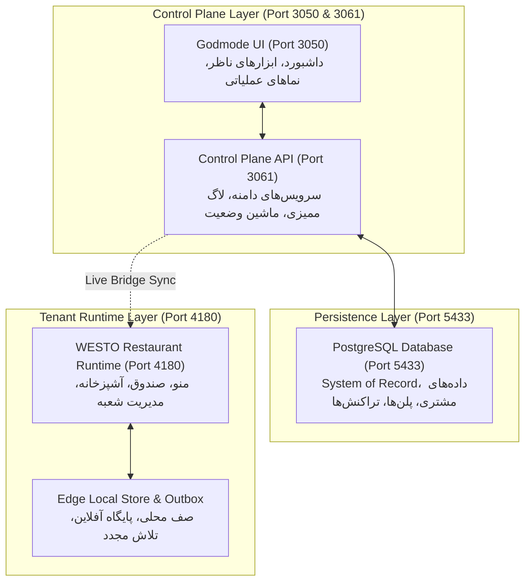
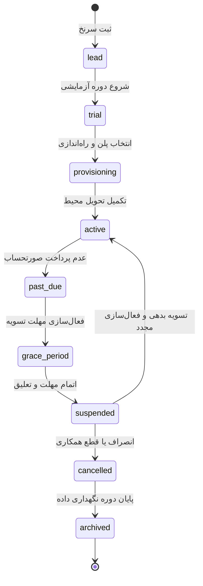

# راهنمای جامع معماری و ساختار درختی SALSA Godmode

> **نسخه مستندات**: ۲.۱ (بازطراحی و ریفکتور جامع معماریمحور)  
> **نقش سامانه**: کنترل‌پلن مرکزی پلتفرم (Platform Control Plane)  
> **اصل اساسی**: **Complexity must be earned.**  
> **شعبه و کلاینت متصل**: کافه وستو (WESTO Cafe)  

---

## فهرست سرفصل‌ها

1. [فلسفه محصول و مرزهای معماری](#۱-فلسفه-محصول-و-مرزهای-معماری)
2. [توپولوژی سرویس‌ها، پورت‌ها و مالکیت داده‌ها](#۲-توپولوژی-سرویس‌ها-پورت‌ها-و-مالکیت-داده‌ها)
3. [ساختار درختی حوزه‌های هفت‌گانه ناوبری](#۳-ساختار-درختی-حوزه‌های-هفت‌گانه-ناوبری)
4. [مرکز کنترل پرونده مشتری (Tenant Control Center - GM-04)](#۴-مرکز-کنترل-پرونده-مشتری-tenant-control-center---gm-04)
5. [موتور محاسبه قطعی مجوزها (Deterministic Entitlements Engine)](#۵-موتور-محاسبه-قطعی-مجوزها-deterministic-entitlements-engine)
6. [ماشین وضعیت چرخه حیات مشتری (Tenant Lifecycle State Machine)](#۶-ماشین-وضعیت-چرخه-حیات-مشتری-tenant-lifecycle-state-machine)
7. [ساختار سازمانی و موجودیت شعبه (Branch as First-Class Entity)](#۷-ساختار-سازمانی-و-موجودیت-شعبه-branch-as-first-class-entity)
8. [تفکیک قلمروهای امنیتی (Platform Identity vs. Tenant Identity)](#۸-تفکیک-قلمروهای-امنیتی-platform-identity-vs-tenant-identity)
9. [ناوگان پایانه‌ها و معماری تداوم آفلاین (Device Fleet & Offline Sync)](#۹-ناوگان-پایانه‌ها-و-معماری-تداوم-آفلاین-device-fleet--offline-sync)
10. [معماری جاری در برابر نقشه راه آتی (Current vs. Future Architecture)](#۱۰-معماری-جاری-در-برابر-نقشه-راه-آتی-current-vs-future-architecture)
11. [فرایندهای استاندارد عملیاتی (PROC-01 تا PROC-06)](#۱۱-فرایندهای-استاندارد-عملیاتی-proc-01-تا-proc-06)

---

## ۱. فلسفه محصول و مرزهای معماری

سامانه **SALSA Godmode** یک پنل مدیریت رستوران (Restaurant Admin Panel) نیست؛ بلکه **Platform Control Plane** یکپارچه برای مدیریت مشتریان سازمانی، اشتراک‌ها، مجوزهای فنی، ناوگان پایانه‌ها و سلامت پلتفرم است.

### مرزبندی صریح:
- **Platform Control Plane (Godmode)**:
  - پایش کلان و سلامت پلتفرم (Platform Overview & Health)
  - مدیریت چرخه حیات مجموعه‌ها (Tenant Lifecycle & Provisioning)
  - کاتالوگ امکانات، پلن‌های قیمتی و مجوزها (Features, Plans & Entitlements)
  - اشتراک‌ها، صدور صورتحساب و مدیریت درآمد (Subscriptions & Billing)
  - ناوگان سخت‌افزاری و پایانه‌ها (Device Fleet Management)
  - پشتیبانی فنی و واگذاری موقت دسترسی (Support & Delegation)
  - امنیت، ردپای ممیزی و حاکمیت پلتفرم (Security, Audit & Governance)
- **Tenant Application (WESTO Client App)**:
  - مدیریت منو، اقلام، دسته‌ها و قیمت‌ها (Menu Management)
  - سفارش‌گیری، فاکتور، صندوق و چاپ رسید (POS Operations)
  - صف آماده‌سازی آشپزخانه و بار گرم (KDS Display)
  - نقشه میزها و سفارش‌گیری سر میز مهمان (Waiter Operations)
  - انبارداری محلی، موجودی مواد اولیه و ثبت اسناد رستوران (Store Operations)

کنترل‌پلن تنها وضعیت این سامانه‌ها، مجوزهای بهره‌برداری آنها یا پیوندهای پرش مستقیم (Jump-to-Tenant) را مدیریت می‌کند و منطق داخلی عملیات رستوران را در خود تکرار نمی‌کند.

---

## ۲. توپولوژی سرویس‌ها، پورت‌ها و مالکیت داده‌ها

در این ریفکتور، وظیفه و مرزهای فنی هر درگاه و سرویس رسماً تثبیت شده و اشاره‌های خام به شماره پورت‌ها از رابط کاربری عمومی به لایه تشخیصی (Diagnostics) منتقل گردیده است:



### شرح تفکیک درگاه‌ها:
- **پورت ۳۰۵۰**: رابط کاربری تحت وب Godmode (Single Page Application بر پایه Vanilla JS/CSS مدرن و سبک).
- **پورت ۳۰۶۱**: هسته سرویس‌های API کنترل‌پلن SALSA، پردازش ماشین وضعیت مشتری، سهمیه‌بندی و محاسبات دسترسی.
- **پورت ۴۱۸۰**: ران‌تایم کلاینت رستورانی کافه وستو شامل وب‌اپلیکیشن‌های منو (`/`)، مدیریت شعبه (`/admin.html`)، صندوق POS (`/pos.html`)، گارسون (`/waiter.html`) و نمایشگر آشپزخانه (`/kitchen.html`).
- **پورت ۵۴۳۳**: پایگاه‌داده اصلی PostgreSQL به عنوان تنها منبع معتبر و ماندگار حقیقت (System of Record).

### شفاف‌سازی پیرامون ذخیره‌سازی محلی (Edge Store vs. SQLite):
- در معماری تداوم آفلاین (Offline-First)، پایگاه‌داده ابری PostgreSQL مرجع نهایی تراکنش‌هاست.
- پایانه‌های مستقر در شعب از یک ذخیره‌ساز محلی (Edge Local Store) به همراه صف برون‌داد (Outbox Queue) و کرسر همگام‌سازی (Last Sync Cursor) بهره می‌برند تا در صورت قطع شبکه، ثبت سفارش و چاپ فاکتور بدون وقفه ادامه یابد و با اتصال مجدد اینترنت، تعارضات بر مبنای Last-Write-Wins تسویه شود.

---

## ۳. ساختار درختی حوزه‌های هفت‌گانه ناوبری

ناوبری اصلی سیستم از ۶ مرحله سازمان‌محور (Stage 1..6) به **۷ حوزه عملیاتی وظیفه‌محور (Task-Oriented Domains)** تبدیل شده است. شماره‌های فنی GM صرفاً به عنوان شناسه پایدار داخلی در روت‌ها حفظ شده‌اند تا هیچ تستی دچار شکست نشود.

```text
SALSA GODMODE CONTROL PLANE
│
├── 🌐 OVERVIEW (پیشخوان و تصویر کلان)
│   ├── وضعیت و آمادگی پلتفرم (#gm-02-overview / #overview)
│   └── پایش بلادرنگ سرویس‌های عملیاتی
│
├── 👥 CUSTOMERS (مشتریان و مجموعه‌ها)
│   ├── فهرست مجموعه‌ها (#gm-03-tenants / #customers/tenants)
│   ├── مرکز کنترل پرونده مشتری (#gm-04-tenant-detail / #customers/detail)
│   ├── ایجاد مشتری جدید (#gm-05-tenant-new / #customers/new)
│   ├── راه‌اندازی و تحویل محیط (#gm-06-provisioning / #customers/provisioning)
│   ├── الگوهای آماده راه‌اندازی (#gm-07-templates)
│   ├── ناوگان دستگاه‌ها و پایانه‌ها (#gm-19-devices / #customers/devices)
│   ├── مرکز تیکت‌ها و پشتیبانی (#gm-21-support / #customers/support)
│   ├── پایگاه مشتریان نهایی (#gm-17-customers)
│   └── پورتال و قرارداد مشتری (#gm-28-portal)
│
├── 📦 PRODUCT (محصول، تعرفه و مجوزها)
│   ├── کاتالوگ سرویس‌ها و ماژول‌ها (#gm-08-features / #product/features)
│   ├── پلن‌ها و سطوح تجاری نسخه‌بندی‌شده (#gm-10-plans / #product/plans)
│   └── ماتریس مجوزهای فعال و اوررایدها (#gm-09-tenant-features / #product/entitlements)
│
├── 💳 REVENUE (درآمد و مالی)
│   ├── اشتراک‌ها، فاکتورها و پرداخت‌ها (#gm-11-billing / #revenue/subscriptions)
│   └── مصرف، سهمیه‌ها و محدودیت‌ها (#gm-12-usage / #revenue/usage)
│
├── ⚙️ OPERATIONS (عملیات و پایداری پلتفرم)
│   ├── سلامت، رخدادها و هشدارها (#gm-22-operations / #operations/health)
│   ├── صف اجرا و کارهای پس‌زمینه (#gm-25-jobs / #operations/jobs)
│   └── پشتیبان‌گیری و بازیابی اطلاعات (#gm-20-backups / #operations/backups)
│
├── 🛡️ SECURITY (امنیت، هویت و دسترسی)
│   ├── ورود و امنیت حساب اپراتور (#gm-01-login)
│   ├── کاربران و اعضای پلتفرم (#gm-13-identities / #security/users)
│   ├── نقش‌ها و ماتریس دسترسی (#gm-14-access-roles / #security/roles)
│   ├── ارزیاب دسترسی و آزمایش مجوز (#gm-15-simulator)
│   └── ردپای ممیزی و لاگ امنیتی (#gm-26-audit / #security/audit)
│
└── 🏛️ PLATFORM (زیرساخت و تنظیمات کلان)
    ├── دامنه و هویت برند (#gm-18-domains / #platform/domains)
    ├── خودکارسازی و قوانین سیستمی (#gm-16-automations)
    ├── نسخه، انتشار و بازگشت پایدار (#gm-23-releases / #platform/releases)
    ├── پایش سرور و زیرساخت VPS (#gm-24-infrastructure / #platform/infrastructure)
    └── تیم راهبری و تنظیمات پلتفرم (#gm-27-team / #platform/settings)
```

---

## ۴. مرکز کنترل پرونده مشتری (Tenant Control Center - GM-04)

در ریفکتور معماری، پرونده مشتری از یک نمای متورم دارای ۱۰ تب موازی و ویرایش‌های پراکنده، به یک **کنسول اجرایی خلاصه و عملیاتی (Tenant Control Center)** تبدیل شد:

### ویژگی‌های کلیدی Tenant Control Center:
1. **نوار بالایی شاخص‌های کلیدی (Executive KPI Strip)**:
   - وضعیت چرخه حیات (`active`, `trial`, `past_due`, `suspended` و ...) با بج رنگی و انطباق SLA.
   - نام پلن و نگارش نسخه‌بندی‌شده (مانند `Enterprise v1`).
   - درآمد ماهانه تکرارشونده (MRR).
   - تعداد شعب و وضعیت برخط بودن پایانه‌های سخت‌افزاری.
2. **کارت‌های خلاصه ۶‌گانه با پیوند منبع واحد حقیقت**:
   - **امکانات و لایسنس‌ها**: نمایش تعداد امکانات مجاز، سقف دستگاه‌های POS و پیوند به `#gm-09-tenant-features`.
   - **اشتراک و صورتحساب**: نمایش آخرین فاکتور، وضعیت تسویه، اعتبار پیامک و پیوند به `#gm-11-billing`.
   - **پایانه‌ها و سخت‌افزار**: وضعیت پایانه‌های شعبه مرکزی و پیوند به `#gm-19-devices`.
   - **پشتیبانی فنی**: تعداد تیکت‌های فعال، وضعیت SLA و پیوند به `#gm-21-support`.
   - **پشتیبان‌گیری ایزوله**: آخرین اسنپ‌شات معتبر، تست یکپارچگی و پیوند به `#gm-20-backups`.
   - **دامنه و ممیزی**: دامنه رسمی، وضعیت گواهی TLS و پیوند به `#gm-18-domains` و `#gm-26-audit`.
3. **حفظ تب‌های درجا (In-Place Tabs)**: تب‌های ۱۰‌گانه در DOM حفظ شده‌اند تا کلیه تست‌های یکپارچگی و تعاملی پایدار بمانند، اما هر تب با بنر منبع واحد حقیقت (Single Source of Truth) کاربران را به صفحه تخصصی هدایت می‌کند.

---

## ۵. موتور محاسبه قطعی مجوزها (Deterministic Entitlements Engine)

مدل مجوزهای پلتفرم از یک متغیر بولی ساده (`true/false`) به یک سیستم قطعی و قابل پیش‌بینی ارتقا یافت:

$$\text{Effective Entitlements} = \left( \text{Plan Features} \cup \text{Tenant Overrides} \right) \setminus \text{Lifecycle Restrictions}$$

### فرمول و پیاده‌سازی در `store.js`:
- **Plan Version**: هر پلن (Starter, Growth, Scale, Enterprise) دارای نگارش مشخص (v1) و لیستی از قابلیت‌های همراه و سقف‌های منابع (`limits`) است.
- **Tenant Overrides**: امکان فعال‌سازی یا غیرفعال‌سازی اختصاصی یک ماژول برای یک مشتری خاص بدون تغییر پلن پایه.
- **محدودیت‌های وضعیت (Status Restrictions)**: در صورتی که وضعیت مشتری به `suspended`، `cancelled` یا `archived` تغییر یابد، امکانات عملیاتی حساس (نظیر POS، صدور فاکتور و KDS) به صورت خودکار مسدود می‌گردند.
- **کاتالوگ پویا**: شمارش قابلیت‌ها دیگر بر روی عدد ۴۸ هاردکد نیست، بلکه مستقیماً از روی کاتالوگ واقعی (۴۴ قابلیت فعال) محاسبه و ارائه می‌شود (`store.getFeaturesCount()`).

---

## ۶. ماشین وضعیت چرخه حیات مشتری (Tenant Lifecycle State Machine)

وضعیت مشتریان از حالت دوگانه ساده به یک ماشین وضعیت جامع با ۹ گام معنادار تبدیل شد:



### اثرات وضعیت بر سامانه:
- انتقال از طریق تابع متمرکز `store.transitionTenantState(tenantId, targetState, reason)` انجام می‌شود.
- هر تغییر وضعیت، رویداد ممیزی رسمی با شناسه بازیگر، زمان دقیق و دلیل در `auditLogs` ثبت می‌کند.
- در وضعیت `suspended` دسترسی کلاینت به وب‌سرویس‌های تجاری قطع می‌گردد.

---

## ۷. ساختار سازمانی و موجودیت شعبه (Branch as First-Class Entity)

مفهوم شعبه (Branch) اکنون به عنوان یک موجودیت مستقل و درجه اول (First-Class Entity) در مدل داده تعریف شده است:

$$\text{Tenant} \longrightarrow \text{Branches} \longrightarrow \text{Devices / Terminals}$$

- **Tenant**: نماینده شخص حقوقی یا برند تجاری مشتری (مانند کافه وستو).
- **Branch**: نماینده پایگاه فیزیکی و عملیاتی (مانند `brn_westo_main` - شعبه مرکزی).
- **Devices**: پایانه‌های فروش، تبلت‌های گارسون و KDS مستقیماً به شناسه شعبه منتسب هستند.
- **Single-Branch Readiness**: برای مشتریان تک‌شعبه‌ای، سوئیچینگ شعبه نامحسوس است؛ در عین حال زیرساخت بدون نیاز به تغییر مدل، آماده اتصال شعب جدید است.

---

## ۸. تفکیک قلمروهای امنیتی (Platform Identity vs. Tenant Identity)

دو حوزه هویتی در کنترل‌پلن از یکدیگر متمایز شده‌اند:
- **Platform Operators**: ناظران ارشد و مهندسان SRE پلتفرم SALSA (مدیریت‌شده در `platformUsers` با نقش‌های `platform_admin` و `platform_sre`).
- **Tenant Staff**: پرسنل داخلی رستوران (صندوق‌دار، سالن‌کار، سرآشپز و مدیر شعبه) که فقط در کلاینت یا برای پشتیبانی دیده می‌شوند.
- **Emergency Support Delegation**: برای رفع ابهام بین شبیه‌ساز دسترسی و ورود اضطراری، دسترسی اضطراری به محیط مشتری تنها از طریق نشست‌های پشتیبانی دارای زمان انقضای مشخص (Time-limited TTL) و ثبت ممیزی صادر می‌شود.

---

## ۹. ناوگان پایانه‌ها و معماری تداوم آفلاین (Device Fleet & Offline Sync)

صفحه مدیریت پایانه‌ها (GM-19) اطلاعات عملیاتی حیاتی را در یک نگاه در اختیار اپراتور قرار می‌دهد:
- نام و نوع دستگاه (POS، تبلت سالن، KDS)
- شعبه استقرار (`شعبه مرکزی`)
- آدرس IP محلی و نگارش نرم‌افزار Edge
- وضعیت اتصال (برخط / آفلاین) و زمان آخرین ضربان (Heartbeat)
- بسته‌های معلق در صف محلی (Pending Queue)
- پیوند یک‌کلیکه به پایانه‌های رستورانی

---

## ۱۰. معماری جاری در برابر نقشه راه آتی (Current vs. Future Architecture)

یکی از اهداف اصلی ریفکتور، حذف وانمودسازی‌های سازمانی و شفاف‌سازی واقعیت عملیاتی جاری بود:

| مؤلفه | وضعیت جاری عملیاتی (Production) | نقشه راه آتی (Roadmap / Defer) |
| :--- | :--- | :--- |
| **استقرار سرورها** | تک‌سرور متمرکز VPS با تفکیک شِما در دیتابیس (پورت‌های ۳۰۵۰، ۳۰۶۱، ۴۱۸۰، ۵۴۳۳) | مدل چندسلولی کنار گذاشته شد (Single VPS Architecture) |
| **پایگاه‌داده** | هسته مرکزی PostgreSQL به همراه صف محلی Edge Outbox | پایگاه‌های چندمرکزی Active-Active توزیع‌شده |
| **انتشار نسخه** | استقرار مستقیم با امکان Rollback فوری به آخرین نسخه پایدار | پایپ‌لاین‌های پیچیده انتشار قناری (Canary Release Orchestration) |
| **امنیت سخت‌افزاری** | احراز هویت مبتنی بر توکن و نشست‌های زمان‌دار امنیتی | مدیریت ماژول‌های سخت‌افزاری HSM و کلیدهای فیزیکی |
| **پشتیبان‌گیری** | اسنپ‌شات‌های منظم ۳۰ روزه با اعتبارسنجی یکپارچگی تراکنش‌ها | دریل‌های بازیابی آنی چندمرکزی (Continuous DR Drills) |

---

## ۱۱. فرایندهای استاندارد عملیاتی (PROC-01 تا PROC-06)

فرایندهای عملیاتی به گونه‌ای بازتنظیم شدند که منطبق بر مدل ذهنی سریع اپراتور باشند:
- **PROC-01 (جذب و راه‌اندازی)**: از ثبت مشتری $\rightarrow$ انتخاب پلن و مجوزها $\rightarrow$ تخصیص دامنه $\rightarrow$ اتصال پایانه‌ها $\rightarrow$ تحویل نهایی.
- **PROC-02 (پایش جامع سلامت)**: تمرکز محض بر پایش سلامت زیرساخت، لتنسی سرویس‌ها، پایداری پایانه‌ها، صف کارها و هشدارهای فعال.
- **PROC-03 (مدیریت تجاری و مالی)**: صدور فاکتورهای دوره‌ای، پیگیری وصول مطالبات، شارژ سهمیه و ارتقای پلن اشتراک.
- **PROC-04 (حاکمیت دسترسی و امنیت)**: مدیریت ناظران پلتفرم، تفکیک نقش‌ها، ممیزی لاگ‌های امنیتی و انقضای نشست‌ها.
- **PROC-05 (مدیریت رخداد و پشتیبانی)**: تریاژ تیکت‌های مشتری، ورود اضطراری از طریق Support Delegation و بازیابی از پشتیبان.
- **PROC-06 (پایداری و زیرساخت)**: پایش توپولوژی سرویس‌ها، پایش صف رخدادها، انتشار نسخه‌های نرم‌افزاری و واگردانی ایمن.
