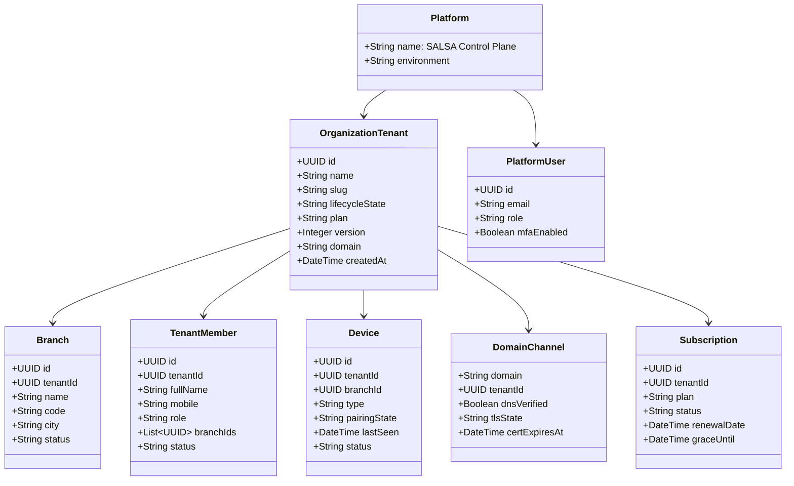

# SALSA Control Plane — Architecture & Domain Inventory

این سند، موجودیت‌های رسمی، منابع حقیقت داده‌ها، کاتالوگ نقش‌ها و اینونتوری ۲۹۲ مسیر ای‌پی‌آی هسته پلتفرم SALSA را به صورت ساختاریافته مشخص می‌کند.

---

## ۱. مدل موجودیت‌های کانونیکال (Canonical Entity Model)

پلتفرم سالسا سلسله‌مراتب دقیق زیر را به عنوان مرجع حقیقت دنبال می‌کند:

### اصطلاحات استاندارد:
1. **Tenant (مجموعه)**: طرف حساب تجاری و دارنده قرارداد سالسا.
2. **Branch (شعبه)**: یک واحد فیزیکی یا مجازی تحت نظارت یک مجموعه.
3. **Tenant Member (عضو تیم مجموعه)**: مدیر، صندوق‌دار، گارسون یا حسابدار مجموعه.
4. **Guest Customer (مهمان / مشتری نهایی)**: مشتریانی که برای غذا خوردن به رستوران آمده‌اند (داده‌های آنها ایزوله در دیتابیس رستوران است و سوپر ادمین تنها با مجوز زمان‌دار و ثبت دلیل به آن دسترسی ممیزی‌شده دارد).
5. **SALSA User (عضو تیم سالسا)**: مهندسان، مدیران مالی و کارشناسان پشتیبانی پلتفرم سالسا.

---

## ۲. کاتالوگ جامع نقش‌ها (Canonical Role Catalog)

| عنوان نقش (Role) | عنوان فارسی | اختیارات کلیدی | سطح دسترسی حساس |
| :--- | :--- | :--- | :---: |
| **PlatformOwner** | مالک ارشد پلتفرم | اختیارات تام، مدیریت تیم سالسا، شکستن قفل اضطراری | 🔴 بحرانی |
| **PlatformAdmin** | مدیر ارشد پلتفرم | ایجاد مجموعه، تغییر پلن، مدیریت دامنه‌ها و لایسنس‌ها | 🔴 بحرانی |
| **OperationsOperator** | راهبر عملیات و زیرساخت | مانیتورینگ حوادث، تله‌متری نودها، انتشار نسخه، رول‌اوت قناری، تلاش مجدد جاب‌ها | 🟠 عملیاتی |
| **FinanceOperator** | مدیر مالی و بازرگانی | مشاهده فاکتورها، تسویه حساب، تمدید مهلت پرداخت، تغییر اشتراک | 🟠 مالی |
| **SupportAgent** | کارشناس پشتیبانی | ایجاد سشن پشتیبانی موقت، بازرسی سلامت، درخواست دسترسی ممیزی PII | 🟡 نظارتی |
| **SecurityAuditor** | ممیز امنیت و تطابق | بازرسی ردپای ممیزی، راستی‌آزمایی زنجیره هش، استخراج گزارش‌های SIEM | 🟡 نظارتی |
| **ReadOnly** | مشاهده‌گر صرف | فقط‌خواندنی در کل پلتفرم (دکمه‌های تغییر غیرفعال، فراخوانی مستقیم API با خطای 403 مسدود می‌شود) | 🟢 بدون خطر |

---

## ۳. خلاصه ۲۹۲ مسیر کنترل‌پلن (Control Plane Routes Inventory)

تمامی این مسیرها در [superadmin/backend/app.js](file:///Users/sasan/Downloads/WESTO-v1.2/superadmin/backend/app.js) و کنترلرهای مربوطه ثبت شده‌اند:

1. **احراز هویت و نشست‌ها (`/api/control/auth`)**: ۸ مسیر شامل لاگین، تأیید کد دومرحله‌ای MFA، کد ریکاوری، پروفایل سشن، خروج و سشن تست.
2. **پیشخوان و نمای کلان (`/api/control/overview`)**: ۴ مسیر شامل سلامت کلان، خلاصه وضعیت ناوگان و آمار لایف‌سایکل.
3. **مدیریت مجموعه‌ها (`/api/control/tenants`)**: ۱۲ مسیر شامل لیست، جزئیات، تغییر چرخه عمر (`/lifecycle`)، شعب و وضعیت سلامت.
4. **خط تحویل و استقرار (`/api/control/provisioning`)**: ۱۸ مسیر شامل شروع نصب، استمرار (Resume)، تلاش مجدد مرحله شکست‌خورده و اعتبارسنجی منابع.
5. **کاتالوگ، سیاست‌ها و کلید قطع (`/api/control/policy`)**: ۲۲ مسیر شامل کاتالوگ ماژول‌ها، Global Kill-Switch، استثنائات لایسنس مجموعه و ارزیابی بلادرنگ.
6. **مالی، پلن‌ها و فاکتورها (`/api/control/billing`)**: ۴۸ مسیر شامل مدیریت پلن‌ها، صدور فاکتور، پرداخت، تمدید دوره مهلت، سهمیه‌ها و کانکتورهای پرداخت.
7. **خودکارسازی، زمان‌بندی و آتباکس (`/api/control/automation`)**: ۳۶ مسیر شامل قوانین خودکارسازی، رانر تسک‌ها، پردازش و تخلیه صف آتباکس.
8. **پایانه‌ها و سخت‌افزارهای لبه (`/api/control/edge`)**: ۲۸ مسیر شامل جفت‌سازی پایانه‌ها، وضعیت آنلاین/آفلاین، پرینترها و رسیدهای تراکنش.
9. **پشتیبان‌گیری و بازیابی (`/api/control/backups`)**: ۱۶ مسیر شامل ساخت بکاپ، دریافت مانیفست، مانور بازیابی تستی (Restore Drill) در محیط امن.
10. **هویت‌ها و اعضای مجموعه (`/api/control/identities`)**: ۲۴ مسیر شامل دعوت مالک، مدیریت اعضا، ابطال نشست‌ها و ماتریس دسترسی.
11. **دامنه‌ها، زیرساخت و SSL (`/api/control/infra`)**: ۲۰ مسیر شامل ثبت دامنه اختصاصی، استعلام DNS و صدور خودکار TLS ACME.
12. **انتشار نسخه‌ها و رول‌اوت قناری (`/api/control/releases`)**: ۱۶ مسیر شامل تعریف نسخه، موج‌های رول‌اوت، قوانین توقف اضطراری (Stop Rules) و بازگشت به نسخه قبل (Rollback).
13. **پشتیبانی ممیزی‌شده و PII (`/api/control/support`)**: ۲۶ مسیر شامل تیکت‌ها، سشن‌های پشتیبانی تاییدشده توسط مشتری، افشای کنترل‌شده اطلاعات هویتی با درج دلیل.
14. **ممیزی تغییرناپذیر (`/api/control/audit`)**: ۱۴ مسیر شامل لاگ‌های ممیزی، بازرسی زنجیره هش ضدجعل و خروجی لاگ‌های امنیتی به سیستم‌های SIEM.
