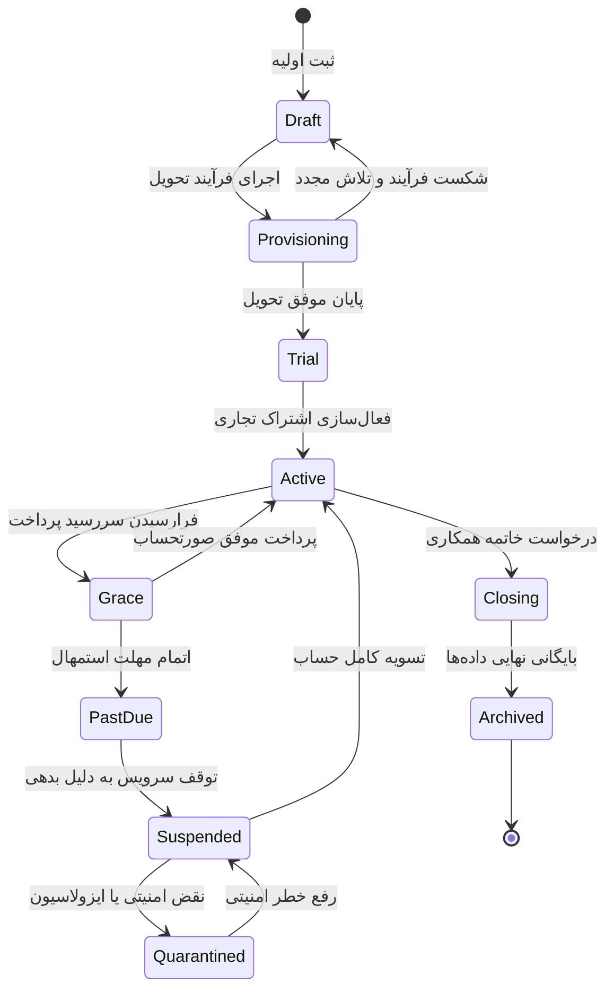

# راهنمای جامع و سند معماری مرکز عملیات پلتفرم سالسا (SALSA CONTROL PLANE)
> **مستندات مرجع راهبری، کنترل‌پلین، امنیت و مدیریت چرخه حیات مجموعه‌ها**  
> **نگارش**: نسخه ۳.۰ (Production Control Plane Canonical Architecture)  
> **آدرس‌های فعال پلتفرم**:  
> • **کنترل پنل سالسا (SALSA Control Plane / Super Admin)**: [http://127.0.0.1:3050](http://127.0.0.1:3050)  
> • **هسته موتور پردازش و امنیت (Control Plane API Engine)**: [http://127.0.0.1:3061](http://127.0.0.1:3061)  
> • **رانتایم کلاینت و شعبه پایلوت (WESTO Pilot Tenant)**: [https://client.salsa.local](https://client.salsa.local)  

---

## ۱. بیانیه معماری و فلسفه طراحی پلتفرم

پلتفرم **SALSA** یک سیستم‌عامل جامع ابری برای مدیریت شبکه‌های رستورانی، کافه‌ها و فودکورت‌های زنجیره‌ای است.  
کنترل‌پلین (God Mode / Super Admin) رابط عملیاتی تیم سالسا برای راهبری صدها و هزاران مجموعه مستقل است؛ بدون سردرگمی، خطای انسانی یا دسترسی مستقیم به پایگاه داده.

### اصول بنیادین:
1. **Simple by default, Deep on demand, Safe always**:
   رابط کاربری در نگاه اول تصمیم‌محور و آرام است؛ جزئیات فنی و تله‌متری عمیق در پنل‌های بازشونده و در صورت تقاضا ارائه می‌شوند.
2. **صداقت کامل در تله‌متری (Zero Fake Data / Zero Fake Success)**:
   هیچ موفقیتی پیش از تأیید سرور نمایش داده نمی‌شود. در صورت قطعی یا خطا، وضعیت به درستی `Unknown`، `Unavailable` یا `Failed` گزارش می‌شود، نه ۱۰۰٪ سبز ساختگی.
3. **ایزولاسیون کامل رانتایم مرورگر**:
   مرورگر ادمین هرگز با رانتایم مستقیم رستوران (Port 4180) ارتباط برقرار نمی‌کند؛ تمام ارتباطات از طریق لایه امن کنترل‌پلین هدایت می‌شوند.
4. **مرکزیت چارچوب دستورات (Central Command Framework)**:
   هیچ جهش یا تغییر وضعیتی مستقیماً از کامپوننت‌های UI انجام نمی‌شود. تمام عملیات حساس از چارچوب متمرکز `GodModeCommandFramework` عبور می‌کنند که شامل پیش‌پرواز، اعتبارسنجی نقش، پیش‌نمایش تأثیر، ثبت دلیل اجباری، کلید یکتایی (Idempotency) و ثبت در زنجیره ممیزی است.

---

## ۲. ساختار ۵ گانه ناوبری کلان (5 Canonical Destinations)

ناوبری کلان سالسا دقیقاً بر روی **۵ مقصد راهبردی** تثبیت شده است:

```
┌─────────────────────────────────────────────────────────────────────────────┐
│ 1. Home (مرکز توجه و صندوق اقدامات فوری)                                    │
│    • پاسخ به سوال اصلی: «هم‌اکنون چه مواردی نیازمند مداخله و اقدام من است؟»     │
│    • صندوق اقدامات (Action Inbox)، تریاژ بدهی‌ها، رخدادهای باز و سلامت گره‌ها  │
├─────────────────────────────────────────────────────────────────────────────┤
│ 2. Restaurants (مدیریت مجموعه‌ها و پرونده ۳۶۰ درجه مشتری)                  │
│    • پاسخ به سوال اصلی: «کدام مشتری نیاز به توجه دارد و وضعیت پرونده چیست؟»     │
│    • شاخص عملیاتی با فیلترهای لایف‌سایکل، جستجوی زنده، ویزارد راه‌اندازی       │
│    • پرونده هر مشتری در ۷ تب متمرکز                                         │
├─────────────────────────────────────────────────────────────────────────────┤
│ 3. Commercial (مرکز کنترل درآمد، اشتراک و بازرگانی)                         │
│    • پاسخ به سوال اصلی: «آیا چرخه مالی، وصولی‌ها و اشتراک‌ها سالم هستند؟»     │
│    • بخش‌های ثانویه: پلن‌ها، اشتراک‌ها، صورتحساب‌ها، سهمیه‌ها و صف مغایرت‌ها   │
├─────────────────────────────────────────────────────────────────────────────┤
│ 4. Operations (مرکز عملیات زیرساخت، رخدادها و استقرار)                     │
│    • پاسخ به سوال اصلی: «آیا پلتفرم سالم است و چه کسی تحت تأثیر است؟»          │
│    • بخش‌های ثانویه: مرکز رخدادها، صف جاب‌ها، تله‌متری سرورها، نسخه‌ها و اتومیشن │
├─────────────────────────────────────────────────────────────────────────────┤
│ 5. Platform Settings (تنظیمات کلان، امنیت و حاکمیت پلتفرم)                 │
│    • پاسخ به سوال اصلی: «چه کسانی و با چه اختیاراتی پلتفرم را کنترل می‌کنند؟»   │
│    • بخش‌های ثانویه: تیم سالسا، سپرهای امنیت، دروازه‌های آمادگی و کاتالوگ سخت‌افزار│
└─────────────────────────────────────────────────────────────────────────────┘
```

---

## ۳. پرونده متمرکز هر مجموعه (Restaurant Workspace — ۷ تب استاندارد)

پرونده هر مجموعه بر پایه ۷ تب عملیاتی طراحی شده و ساختار ۱۶ تبه قدیمی منسوخ شده است:

| تب | عنوان فارسی | ماموریت و کارکرد عملیاتی |
| :--- | :--- | :--- |
| **1. Overview** | شناسنامه و دیده‌بانی | معماری ۳ لایه: وضعیت و لایف‌سایکل، هویت تجاری، و سیگنال‌های بلادرنگ عملیاتی |
| **2. Subscription** | اشتراک و ماژول‌ها | پلن جاری، افزونه‌های فعال، سهمیه‌ها و ماشین محاسبه دسترسی موثر (Effective Entitlements) |
| **3. People** | پرسنل و دسترسی | مالکان، مدیران و پرسنل مجموعه (جداسازی مطلق از مشتریان نهایی CRM) |
| **4. Hardware** | سخت‌افزار و پایانه‌ها | پایانه‌های POS، نمایشگرهای KDS، چاپگرهای صدور فیش و آزمون بدون تماس مستقیم |
| **5. Channels** | دامنه‌ها و برندینگ | دامنه‌های سفارشی، وضعیت صدور خودکار گواهی TLS 1.3 و تایید رکورد DNS |
| **6. Reliability** | پایداری و بازیابی | شاخص‌های RPO/RTO، استریم پیوسته لاگ‌های WAL، آرشیو پشتیبان و مانور بازیابی در سندباکس |
| **7. Activity** | ردپای ممیزی | تاریخچه رویدادهای ممیزی سرور با امضای ضدجعل SHA-256 و فیلترهای زمانی |

---

## ۴. ماشین حالات لایف‌سایکل مجموعه‌ها (Canonical Lifecycle State Machine)

لایف‌سایکل هر مجموعه از یک متغیر بولی فراتر رفته و از ماشین حالات ۱۰ مرحله‌ای پیروی می‌کند:



تمام انتقال حالات از طریق دستورات چارچوب فرماندهی با ذکر شناسه درخواست و ثبت دلیل انجام می‌پذیرد.

---

## ۵. امنیت، نقش‌ها و احراز هویت (Platform RBAC & Security)

### کاتالوگ نقش‌های کاننیکال پلتفرم:
- **PlatformOwner**: مالک ارشد پلتفرم با اختیار تام برای عملیات مخرب و پیکربندی کلان.
- **PlatformAdmin**: راهبر پلتفرم برای مدیریت مشتریان، کاربران و تغییرات غیرمخرب.
- **OperationsOperator**: مهندسی عملیات برای مدیریت استقرار، جاب‌ها، پروب‌ها و کاناری.
- **FinanceOperator**: کارشناس مالی برای مدیریت فاکتورها، ثبت وصولی و استمهال بدهی.
- **SupportAgent**: پشتیبان فنی با دسترسی زمان‌دار به نشست‌های تفویض‌شده پشتیبانی.
- **SecurityAuditor**: ممیز انطباق برای بررسی یکپارچگی زنجیره هش و کشف دست‌کاری.
- **ReadOnly**: ناظر عمومی بدون هیچ‌گونه اجازه ثبت یا تغییر داده.

### دروازه‌های آمادگی عملیاتی پروداکشن (۱۰ دروازه کلان):
1. **پایگاه داده (Database Health)**: اتصال پایدار و عدم کسری جداول سیستمی.
2. **مایگریشن‌ها (Schema Migrations)**: اعمال کامل تمامی نسخه‌های ثبت‌شده در دفتر کل.
3. **احراز هویت (Platform Auth)**: صدور نشست‌های امن و الزامات MFA/TOTP.
4. **یکپارچگی ممیزی (Audit Integrity)**: پیوستگی زنجیره هش رمزنگاری SHA-256 تا کلید پیدایش.
5. **پشتیبان‌گیری (Backup & RPO)**: اجرای منظم سیاست پشتیبان‌گیری و مانورهای سندباکس.
6. **درگاه صورتحساب (Billing Gateway)**: موتور صدور فاکتور رسمی و شناسه‌های تسویه یکتا.
7. **زیرساخت دامنه‌ها (Domain & TLS)**: صدور خودکار گواهی ACME و اتصال به پراکسی ورودی.
8. **مدیریت کلیدها (Secrets Management)**: استفاده از کلیدهای محیطی ایزوله در پروداکشن.
9. **صف وظایف (Queues & Outbox)**: پردازش پیوسته وظایف ناهمگام بدون انباشت در صف خطا.
10. **ناوگان Edge (Edge Connectivity)**: پروب‌های ایزوله بدون تماس مستقیم مرورگر.

---

## ۶. سامان‌دهی نام‌گذاری NEEM، SALSA و موقعیت مجموعه WESTO

### نام‌گذاری تاریخی NEEM:
جداول پایگاه‌داده با پیشوند `neem_*` (مانند `neem_tenants`, `neem_control_audit_events`) به عنوان **فضای نام داخلی و پایدار لایه ذخیره‌سازی** حفظ شده‌اند تا از بروز اختلال، شکستگی در مایگریشن‌های تاریخی یا آسیب به دیتابیس عملیاتی جلوگیری شود. در لایه Domain و تمام ارتباطات بیرونی، واژگان استاندارد **SALSA CONTROL PLANE** تنها زبان رسمی پلتفرم است.

### موقعیت مجموعه WESTO:
مجموعه **WESTO** (با شناسه `tnt_westo_demo`) نخستین مشتری مرجع (Pilot Tenant / Tenant #1) پلتفرم سالسا است. کنترل‌پلین سالسا به صورت کاملاً عمومی (Generic SaaS) طراحی شده و هیچ کد یا مسیر شرطی اختصاصی برای یک مشتری خاص ندارد؛ وضعیت پایلوت وستو صرفاً یک متادیتای ساختاریافته در پرونده مشتری است.

---

## ۷. کلیدهای میانبر و جستجوی سراسری (Cmd/Ctrl + K)

اپراتور در هر صفحه‌ای با فشردن کلیدهای `Cmd + K` (یا `Ctrl + K`) به پالت فرماندهی و موتور جستجوی سراسری دسترسی دارد:
- **جستجوی هوشمند در**: نام مجموعه، شناسه مشتری، نام شعبه، دامنه اختصاصی، شماره تماس، نام مالک، شناسه فاکتور، نام و مدل دستگاه، شناسه جاب و Correlation ID.
- **اقدامات سریع**: ایجاد مجموعه جدید، جستجوی فاکتور، مشاهده رخدادهای باز، صف کارهای ناموفق، بازرسی ممیزی و تغییر پوسته سامانه.
